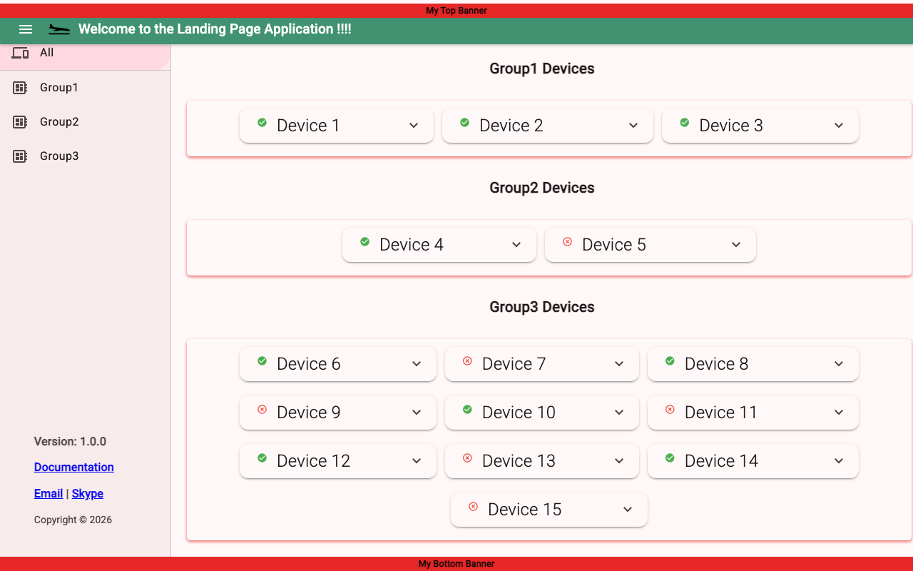

# Landing Page App

A device dashboard landing page built with **Angular 21** and **Angular Material**. Displays devices organized into groups, each rendered as an expandable card showing its name, status, description, and a quick-launch link.



## Features

- **Side navigation with device-type filtering** — A collapsible side nav lists all unique device types extracted from the config. Selecting a type filters the dashboard to show only matching groups; the default "All" filter shows everything.
- **Hamburger menu toggle** — A toolbar hamburger icon opens and closes the side navigation.
- **Fixed-position banners** — A banner component renders top and bottom viewport-fixed banners for site-wide announcements.
- **Sidenav footer** — A footer component pinned to the bottom of the side navigation displays version info, documentation link, email, and chat links.
- **Branded toolbar** — Displays a logo and welcome title in a sticky Material toolbar.
- **Device groups** — Devices are organized into named groups with a configurable device type, all driven by a JSON file.
- **Expandable device cards** — Each device uses a Material accordion panel that reveals a description and action buttons when expanded.
- **Status indicators** — Devices show an active/inactive status with corresponding Material icons.
- **Server-side rendering** — Supports SSR via Angular SSR and Express.
- **Runtime device loading** — Device configuration is fetched via HTTP from `assets/config/devices.json` at runtime, with a bundled JSON fallback, allowing updates without rebuilding.
- **Typed data model** — TypeScript interfaces (`Devices`, `DeviceGroup`, `Device`) ensure type safety across services and components.
- **Configurable** — Device data is driven by [`public/assets/config/devices.json`](public/assets/config/devices.json), making it easy to add or modify devices and groups without changing code.
- **Fully self-contained assets** — All fonts (Roboto, Material Icons), images, and config are bundled locally — no external CDN requests at runtime.

## Tech Stack

- Angular 21 with standalone components
- Angular Material & CDK
- Tailwind CSS (PostCSS plugin) + SCSS
- Express (SSR)
- Karma & Jasmine (testing)

## Project Structure

```text
public/
└── assets/
    ├── config/
    │   └── devices.json          # Device/group configuration (served at runtime)
    ├── fonts/
    │   ├── roboto/               # Roboto woff2 files (latin + latin-ext)
    │   └── material-icons/       # Material Icons woff2
    └── images/                   # Static images (logo, etc.)
src/
├── fonts.css                     # Local @font-face declarations
├── app/
│   ├── app.ts                    # Root component (toolbar + sidenav shell)
│   ├── app.routes.ts             # Route definitions
│   ├── banner/                   # Fixed-position top/bottom banner component
│   ├── footer/                   # Sidenav footer (version, links, copyright)
│   ├── types/
│   │   └── devices.ts            # Interfaces: Devices, DeviceGroup, Device
│   ├── services/
│   │   ├── device-filter.service.ts   # Shared filter state (signal-based)
│   │   └── device-status.service.ts   # HTTP fetch of device config
│   ├── main-page/                # Main dashboard page
│   │   ├── main-page.ts
│   │   ├── main-page.html
│   │   └── main-page.scss
│   └── device/
│       ├── device-1/             # Expandable device card component
│       └── device-2/             # Alternate device component (placeholder)
└── styles.scss                   # Global styles
```

## Getting Started

### Prerequisites

- Node.js (v20+)
- Angular CLI v21

### Install dependencies

```bash
npm install
```

### Development server

```bash
ng serve
```

Navigate to `http://localhost:4200/`. The app reloads automatically on source changes.

### Build

```bash
ng build
```

Build artifacts are written to `dist/`.

### Run with SSR

```bash
npm run serve:ssr:landing-page-app
```

### Run tests

```bash
ng test
```

## Configuration

Edit [`public/assets/config/devices.json`](public/assets/config/devices.json) to define device groups and devices. This file is served as a static asset and fetched via HTTP at runtime, so changes take effect without rebuilding:

```json
{
  "device_groups": [
    {
      "name": "group1",
      "type": "Sensors",
      "devices": [
        {
          "name": "Device 1",
          "description": "This is the first device.",
          "url": "http://device-1",
          "status": true
        }
      ]
    }
  ]
}
```text

**Group fields:**

| Field    | Type   | Description                                      |
| -------- | ------ | ------------------------------------------------ |
| `name`   | string | Display name for the group                       |
| `type`   | string | Device type label used for side-nav filtering (e.g. `Sensors`, `Controllers`, `Actuators`) |

**Device fields:**

| Field         | Type    | Description                          |
| ------------- | ------- | ------------------------------------ |
| `name`        | string  | Display name for the device          |
| `description` | string  | Description shown in the card body   |
| `url`         | string  | Link opened by the "GO!" button      |
| `status`      | boolean | `true` = Active, `false` = Inactive  |
